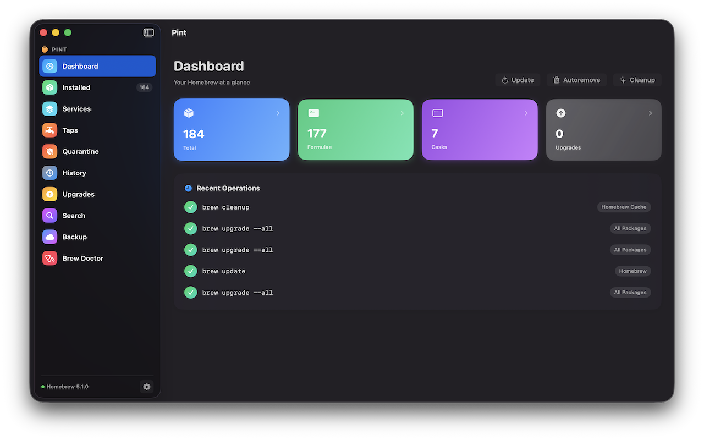
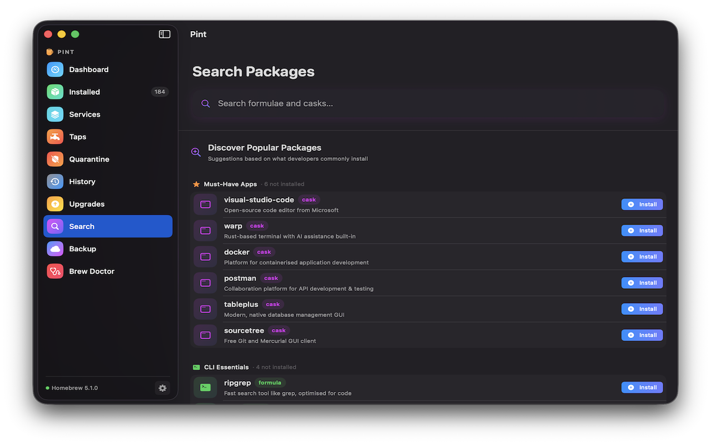
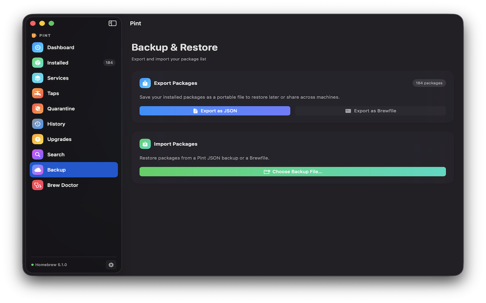

# Pint

> A native macOS app for managing Homebrew packages — built with SwiftUI.

Browse, search, install, upgrade, and uninstall formulae and casks without touching the terminal.

---

## Features

### Package Management
- **Dashboard** — stat cards showing total packages, formulae, casks, and available upgrades
- **Installed Packages** — browse, filter (All / Formulae / Casks), and search installed packages
- **Upgrades** — view outdated packages with version comparison; upgrade individually or all at once; pinned packages shown separately
- **Search** — fast package discovery powered by the Homebrew JSON API with popular suggestions
- **Taps** — browse, add, and remove Homebrew taps
- **Services** — start, stop, and restart `brew services` without leaving the app
- **Quarantine** — view and manage quarantined packages

### Package Details
- **Pin / Unpin** — pin formulae to hold them at their current version
- **Caveats** — post-install instructions surfaced directly in the detail view
- **Release Notes** — GitHub release notes fetched and displayed per package
- **Personal Notes** — attach your own notes to any package
- **Dependency Tree** — visualise package dependencies

### History & Operations
- **History** — persistent log of past operations with full terminal output
- **Live Output** — streaming install/upgrade/uninstall progress with collapsible output
- **Cancel** — cancel any running brew operation mid-flight
- **Brew Doctor** — run diagnostics and view health warnings in-app

### Menu Bar
- **Menu Bar Icon** — quick access from the menu bar; badge shows pending upgrade count
- **Background Checks** — automatically checks for outdated packages on a configurable interval (15 min / 1 h / 4 h / daily)
- **Background Mode** — closing the main window hides to the menu bar instead of quitting

### Backup & Restore
- **Export** — save installed packages as JSON or Brewfile
- **Import** — restore packages from a backup with selective install
- **Brewfile Compatible** — export works directly with `brew bundle install`

### Auto-Updates
- Built-in Sparkle updater — Pint notifies you when a new version is available and updates in-place

---

## Screenshots

| Dashboard | Search | Backup & Restore |
|---|---|---|
|  |  |  |

---

## Installation

### Download (Recommended)

1. Go to [Releases](../../releases/latest)
2. Download `Pint-x.x.x.dmg`
3. Open the DMG, drag `Pint.app` to `/Applications`
4. Launch — no "right-click → Open" required (notarized by Apple)

### Build from Source

```bash
git clone https://github.com/codingprotocols/Pint.git
cd Pint
open Pint.xcodeproj
```

Press `⌘R` to build and run.

---

## Requirements

| | Minimum |
|---|---|
| macOS | 15.0 (Sequoia) |
| Xcode | 16.0+ (build from source only) |
| Homebrew | [brew.sh](https://brew.sh) |

If Homebrew is not installed, Pint shows step-by-step installation instructions on launch.

---

## Project Structure

```
Pint/
├── PintApp.swift                  # App entry point, MenuBarExtra, AppDelegate
├── ContentView.swift              # Root NavigationSplitView + BrewNotFoundView
├── Models/
│   ├── BrewPackage.swift          # Package, tap, and service data models
│   ├── BrewServiceItem.swift      # brew services model
│   └── AppSettings.swift         # UserDefaults keys and enums
├── ViewModels/
│   ├── AppViewModel.swift         # Central @Observable view model + OperationRunner
│   ├── ServicesViewModel.swift    # Services-specific state
│   └── AppNavigationState.swift   # Navigation state
├── Views/
│   ├── DashboardView.swift        # Stat cards and recent operations
│   ├── InstalledView.swift        # Installed packages with split panel
│   ├── UpgradesView.swift         # Outdated packages
│   ├── SearchView.swift           # Package search with popular suggestions
│   ├── TapsView.swift             # Tap management
│   ├── ServicesView.swift         # brew services management
│   ├── QuarantineView.swift       # Quarantined packages
│   ├── HistoryView.swift          # Operation history
│   ├── PackageDetailView.swift    # Per-package detail panel
│   ├── BackupView.swift           # Export / import packages
│   ├── DoctorView.swift           # brew doctor diagnostics
│   ├── MenuBarView.swift          # Menu bar popover
│   ├── SettingsView.swift         # App settings
│   └── TerminalOutputView.swift   # Live operation output
├── Services/
│   ├── ShellExecutor.swift        # Process wrapper with streaming output
│   ├── BrewService.swift          # High-level brew CLI operations
│   ├── BrewAPIClient.swift        # Homebrew JSON API + GitHub Releases
│   └── BackupManager.swift        # Export / import logic
└── Helpers/
    ├── LiquidGlassModifier.swift  # Shared frosted-glass ViewModifier
    ├── SharedComponents.swift     # Reusable UI components
    └── CheckForUpdatesView.swift  # Sparkle update UI
```

---

## Architecture

| Layer | Technology |
|---|---|
| UI | SwiftUI, NavigationSplitView, MenuBarExtra |
| State | `@Observable`, `@MainActor` |
| Networking | URLSession (Homebrew JSON API, GitHub Releases) |
| Shell | Foundation.Process with streaming output |
| Concurrency | Swift Concurrency (async/await, actors) |
| Settings | @AppStorage, SMAppService |
| Updates | Sparkle 2.x (EdDSA-signed, notarized) |

---

## Releasing

Bump the version, tag, and push — GitHub Actions handles the rest (universal build, code signing, notarization, DMG, Sparkle appcast update, GitHub Release):

```bash
./bump-version.sh patch   # 1.x.N
./bump-version.sh minor   # 1.N.0
./bump-version.sh major   # N.0.0

git tag v1.x.x
git push origin v1.x.x
```

---

## License

MIT © [Coding Protocols Private Limited](https://github.com/codingprotocols)
